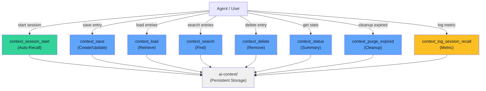

# API Reference

All tools are exposed via the Model Context Protocol (MCP) interface. Use these in any MCP-compatible agent.



## context_session_start

**Call this FIRST at session start.** Auto-loads project + decisions memory and shows a compact index of all other categories. Returns recent session recall stats.

### Parameters

None

### Returns

- `auto_loaded` - Full entries from `project` and `decisions` categories
- `compact_index` - One-line summaries (key + lead fact) for `errors`, `tasks`, `ephemeral`
- `recent_session_recall_stats` - Whether past sessions used recall before edits

### Example

```python
session = context_session_start()
# Read auto-loaded project knowledge
for entry in session["auto_loaded"]["project"]:
    print(f"{entry['key']}: {entry['value']}")
```

## context_save

Save or update a memory entry.

### Parameters

- **category** (required) - One of: `project`, `decisions`, `errors`, `tasks`, `ephemeral`
- **key** (required) - Unique identifier within the category
- **value** (required) - The content to remember. **Put the key fact on the first line.**
- **tags** (optional) - List of searchable tags
- **ttl_days** (optional) - Override default TTL. `None` means never expires
- **what_worked** (optional) - What worked about this decision/error. Only valid for `decisions` and `errors` categories.
- **what_failed** (optional) - What failed about this decision/error. Only valid for `decisions` and `errors` categories.
- **superseded_by** (optional) - Key of the entry that supersedes this one. Recall follows the pointer.

### Returns

Entry is saved and persisted to disk. If updating an existing entry, `created_at` is preserved.

### Example

```python
context_save(
    category="decisions",
    key="auth-strategy",
    value="Using OAuth2 for authentication\nGitHub provider, JWT tokens",
    tags=["auth", "security"],
    what_worked="Zero server-side state, scales horizontally",
    what_failed="Token refresh adds complexity"
)
```

## context_load

Retrieve entries from a category.

### Parameters

- **category** (required) - Category to load
- **include_expired** (optional) - Include expired entries. Default: `False`

### Returns

List of entries with:
- `key` - Entry identifier
- `value` - Content
- `age_days` - How old the entry is
- `ttl_days` - Time-to-live in days
- `tags` - List of tags
- `source` - Who created it
- `what_worked` - What worked (decisions/errors only)
- `what_failed` - What failed (decisions/errors only)
- `superseded_by` - Key of successor entry, if superseded

### Example

```python
entries = context_load(category="decisions")
for entry in entries:
    print(f"{entry['key']}: {entry['value']}")
```

## context_search

Search across all categories by keyword. Superseded entries are excluded (their successors are returned instead).

### Parameters

- **query** (required) - Search term (case-insensitive)

### Returns

List of matching entries. Results only include active (non-expired, non-superseded) entries.

### Example

```python
results = context_search(query="database")
print(f"Found {len(results)} entries about database")
```

## context_delete

Delete a specific entry.

### Parameters

- **category** (required) - Category name
- **key** (required) - Entry key to delete

### Returns

`True` if entry was found and deleted, `False` otherwise.

### Example

```python
if context_delete(category="tasks", key="old-task"):
    print("Task deleted")
else:
    print("Task not found")
```

## context_status

Get a summary of all categories.

### Parameters

None

### Returns

List of category summaries with entry counts, staleness, and descriptions.

### Example

```python
status = context_status()
for cat_summary in status["categories"]:
    print(f"{cat_summary['category']}: {cat_summary['active_entries']} active")
```

## context_purge_expired

Remove all expired entries across all categories.

### Parameters

None

### Returns

Integer count of entries removed.

### Example

```python
removed = context_purge_expired()
print(f"Cleaned up {removed} expired entries")
```

## context_log_session_recall

Log whether recall fired before the first edit in this session. Call at session end to record the metric.

### Parameters

None

### Returns

- `logged` - Boolean indicating success
- `recall_fired` - Whether recall was used before first edit

### Example

```python
result = context_log_session_recall()
print(result["message"])  # "Session recall fired before first edit: YES"
```

## Data Model

### ContextEntry

```python
{
    "key": str,                  # Unique identifier
    "value": str,               # Content (key fact on first line recommended)
    "category": str,            # project|decisions|errors|tasks|ephemeral
    "created_at": datetime,     # ISO format
    "updated_at": datetime,     # ISO format
    "ttl_days": int | None,     # Days until expiry, None = never
    "tags": list[str],          # Searchable labels (pipe-delimited in .md files)
    "source": str,              # "agent" or "human" or custom
    "what_worked": str | None,  # What worked (decisions/errors only)
    "what_failed": str | None,  # What failed (decisions/errors only)
    "superseded_by": str | None,# Key of successor entry
    "is_expired": bool,         # Computed property
    "is_superseded": bool       # Computed property
}
```

## Error Handling

All tools return clear responses. Common scenarios:

### Invalid Category
```python
context_save(category="invalid", key="k", value="v")
# Returns: {"error": "Unknown category 'invalid'. Valid: [...]"}
```

### Outcome Fields on Wrong Category
```python
context_save(category="project", key="k", value="v", what_worked="yes")
# Raises: ValueError: what_worked/what_failed are only valid for decisions or errors
```

## Storage Location

All data stored in: `<project_root>/ai-context/`

Files are in Markdown format, editable manually if needed. Tags are pipe-delimited (`|`) in the meta comments.
