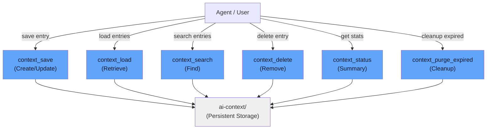

# API Reference

All tools are exposed via the Model Context Protocol (MCP) interface. Use these in any MCP-compatible agent.



## context_save

Save or update a memory entry.

### Parameters

- **category** (required) - One of: `project`, `decisions`, `errors`, `tasks`, `ephemeral`
- **key** (required) - Unique identifier within the category
- **value** (required) - The content to remember
- **tags** (optional) - List of searchable tags
- **ttl_days** (optional) - Override default TTL. `None` means never expires
- **source** (optional) - Who is saving this. Default: `"agent"`

### Returns

Entry is saved and persisted to disk.

### Example

```python
context_save(
    category="project",
    key="auth-strategy",
    value="Using OAuth2 for authentication",
    tags=["auth", "security"],
    ttl_days=None
)
```

## context_load

Retrieve entries from a category.

### Parameters

- **category** (required) - Category to load
- **include_expired** (optional) - Include expired entries. Default: `False`

### Returns

List of `ContextEntry` objects with:
- `key` - Entry identifier
- `value` - Content
- `created_at` - Creation timestamp
- `updated_at` - Last update timestamp
- `ttl_days` - Time-to-live in days
- `tags` - List of tags
- `source` - Who created it
- `is_expired` - Boolean indicating if expired

### Example

```python
entries = context_load(category="project")
for entry in entries:
    print(f"{entry.key}: {entry.value}")
```

## context_search

Search across all categories by keyword.

### Parameters

- **query** (required) - Search term (case-insensitive)

### Returns

List of `ContextEntry` objects that match the query in:
- Entry key
- Entry value
- Entry tags

Results only include active (non-expired) entries.

### Example

```python
results = context_search(query="database")
print(f"Found {len(results)} entries about database")
```

## context_delete

Delete a specific entry.

### Parameters

- **category** (required) - Category name
- **key** (required) - Entry key to delete

### Returns

`True` if entry was found and deleted, `False` otherwise.

### Example

```python
if context_delete(category="tasks", key="old-task"):
    print("Task deleted")
else:
    print("Task not found")
```

## context_status

Get a summary of all categories.

### Parameters

None

### Returns

List of category summaries, each containing:
- `category` - Category name
- `description` - Category purpose
- `total_entries` - Total entries (including expired)
- `active_entries` - Non-expired entries
- `expired_entries` - Expired entries
- `oldest_days` - Age of oldest active entry

### Example

```python
status = context_status()
for cat_summary in status:
    print(f"{cat_summary['category']}: {cat_summary['active_entries']} active")
```

## context_purge_expired

Remove all expired entries across all categories.

### Parameters

None

### Returns

Integer count of entries removed.

### Example

```python
removed = context_purge_expired()
print(f"Cleaned up {removed} expired entries")
```

## Data Model

### ContextEntry

```python
{
    "key": str,                  # Unique identifier
    "value": str,               # Content
    "category": str,            # project|decisions|errors|tasks|ephemeral
    "created_at": datetime,     # ISO format
    "updated_at": datetime,     # ISO format
    "ttl_days": int | None,     # Days until expiry, None = never
    "tags": list[str],          # Searchable labels
    "source": str,              # "agent" or "human" or custom
    "is_expired": bool           # Computed property
}
```

### CategoryFile

Represents all entries in a category:

```python
{
    "category": str,
    "entries": list[ContextEntry],
    "active_entries": list[ContextEntry],  # Filtered non-expired
    "summary": dict  # Stats about the category
}
```

## Error Handling

All tools return clear responses. Common scenarios:

### Entry Not Found
```python
# context_delete returns False
result = context_delete(category="tasks", key="nonexistent")
# result is False
```

### Invalid Category
```python
# Will raise validation error
context_save(category="invalid", key="k", value="v")
# Error: invalid is not a valid Category
```

### Expired Entry
```python
# Expired entries are excluded by default
entries = context_load(category="errors")
# Only active entries returned

# To include expired:
all_entries = context_load(category="errors", include_expired=True)
```

## Rate Limits

No built-in rate limits. Constraints are:

- File I/O based on disk speed
- Memory for search indexing
- TTL processing on demand

For high-volume scenarios, consider running purge_expired() during off-peak times.

## Storage Location

All data stored in: `<project_root>/ai-context/`

Files are in Markdown format, editable manually if needed.
