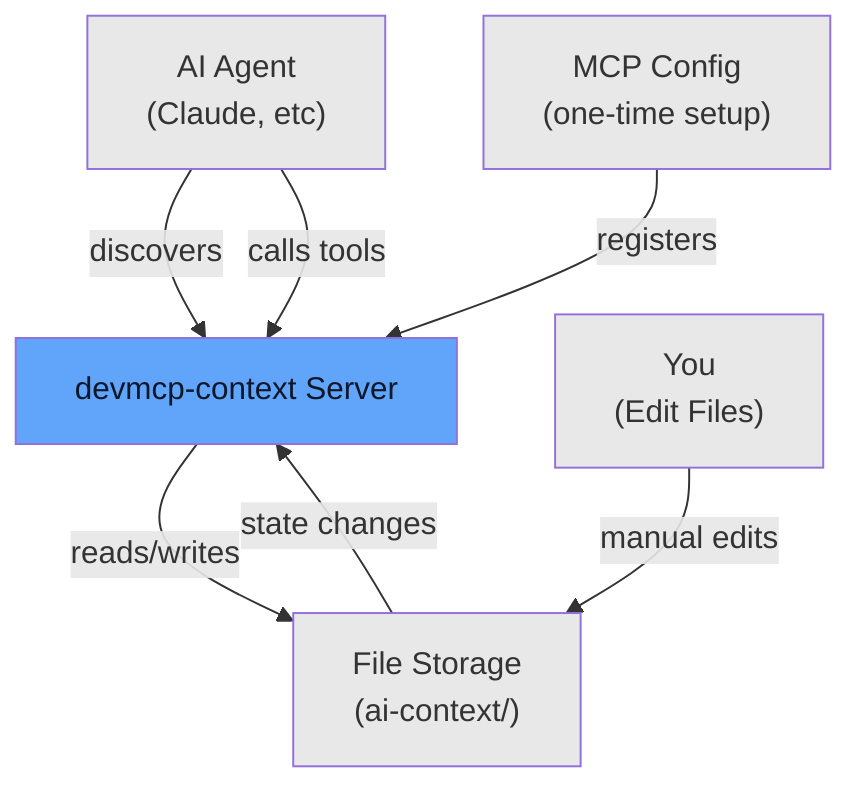
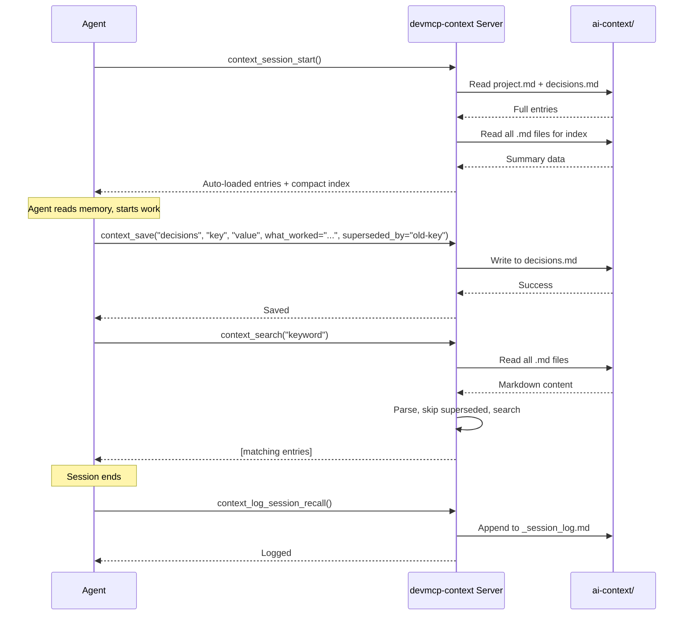
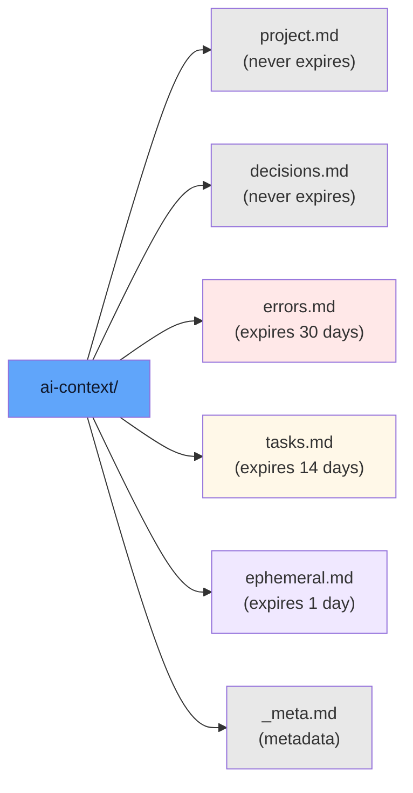
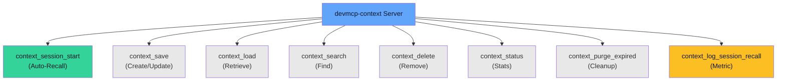
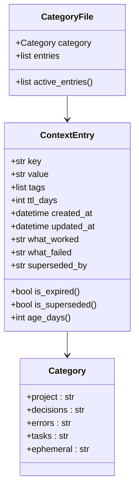

# Architecture

## System Overview

**Key insight:** The agent doesn't manage the server lifecycle. Once configured, the server runs automatically when the agent connects.

## Request Flow

## Memory Organization

Each file contains entries in Markdown format. Entries include metadata (TTL, creation date, tags) and are parsed on each request.

## Tool Ecosystem

All tools operate on the same file-based storage. No database, no complexity.

## Data Model

- `created_at` is preserved across updates (not reset)
- `superseded_by` points to the successor entry; recall skips superseded entries
- `what_worked` / `what_failed` are only valid for `decisions` and `errors` categories
- Tags use pipe `|` as delimiter in markdown files (not comma)

## Deployment Models

```mermaid
graph TB
    subgraph Local["Local Development"]
        L1["User's Project"]
        L2["ai-context/"]
        L3["devmcp-context (local)"]
        L1 --> L3
        L3 --> L2
    end
    
    subgraph Agent["Agent Integration"]
        A1["Claude Desktop / Node.js / Python"]
        A2["MCP Config"]
        A3["devmcp-context Server"]
        A1 --> A2
        A2 --> A3
    end
    
    subgraph Production["Production"]
        P1["Docker Container"]
        P2["Persistent Volume"]
        P3["devmcp-context"]
        P1 --> P3
        P3 --> P2
    end
    
    style L1 fill:#e8e8e8
    style L2 fill:#f0f0f0
    style L3 fill:#60a5fa,color:#0f172a
    style A1 fill:#e8e8e8
    style A2 fill:#e8e8e8
    style A3 fill:#60a5fa,color:#0f172a
    style P1 fill:#e8e8e8
    style P2 fill:#f0f0f0
    style P3 fill:#60a5fa,color:#0f172a
```

Supports dev (CLI), agent-integrated (MCP config), and containerized deployments.
