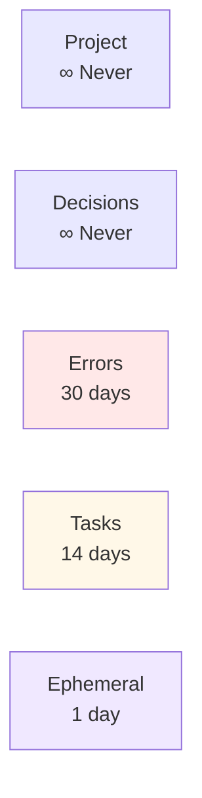
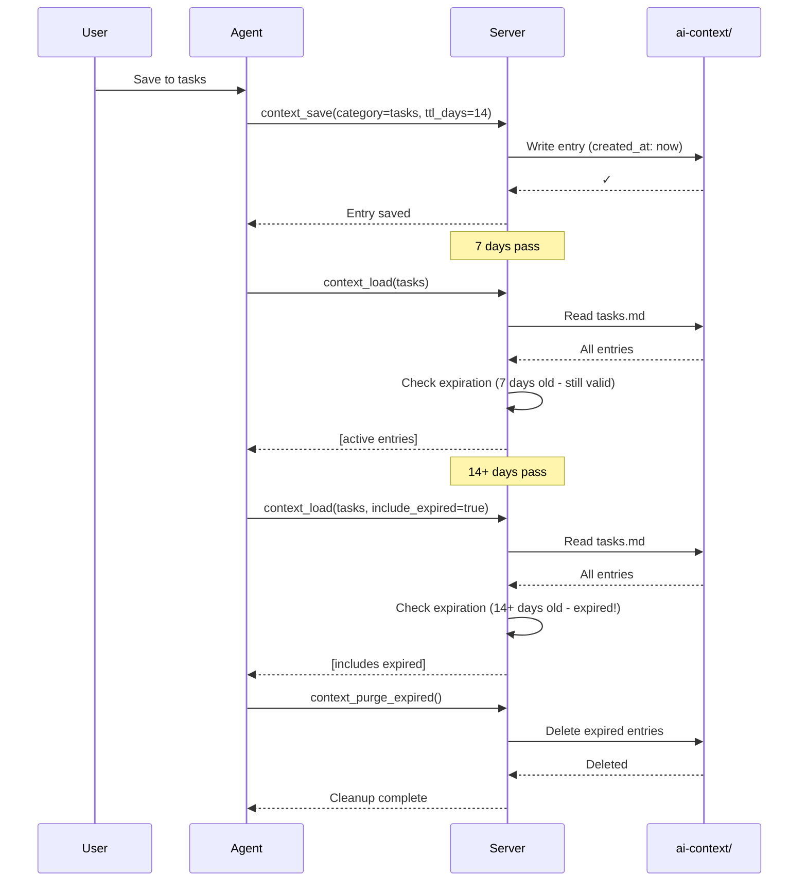

# Memory Categories

devmcp-context organizes memory into five categories, each with a specific purpose and default expiration policy.

## Category Overview

| Category | Purpose | Default TTL | Use When |
|----------|---------|-------------|----------|
| project | Stack, goals, conventions, repo structure | Never | Long-term project knowledge |
| decisions | Why X was chosen over Y — architectural choices | Never | Important design decisions |
| errors | Bugs seen, fixes tried, what worked | 30 days | Recording known issues and solutions |
| tasks | In progress, blocked, recently completed | 14 days | Tracking current work |
| ephemeral | Scratchpad — temporary data | 1 day | Session notes and temporary context |



Each entry can have `what_worked` and `what_failed` fields (decisions/errors only), and `superseded_by` to redirect recall to a successor entry.

## TTL Lifecycle



## Project

Long-term project knowledge that rarely changes.

### Default TTL: Never expires

### Examples

Stack and technology choices:
```
key: "stack"
value: "Python 3.12, FastAPI, PostgreSQL 15, Redis"
```

Project structure:
```
key: "directory-structure"
value: "
/src - source code
/tests - test suite
/docs - documentation
/deployment - docker and k8s configs
"
```

Code conventions:
```
key: "naming-conventions"
value: "
- Snake case for variables and functions
- PascalCase for classes
- ALL_CAPS for constants
"
```

Build and deployment:
```
key: "build-command"
value: "make build && docker build -t myapp:latest ."
```

### When to Use

- Information that applies to the entire project
- Knowledge that doesn't change frequently
- Reference material for new team members
- Architectural context

## Decisions

Significant architectural and design decisions. Why certain choices were made.

### Default TTL: Never expires

### Outcome Fields

Decisions support `what_worked` and `what_failed` to track outcomes:

```python
context_save(
    category="decisions",
    key="why-postgresql",
    value="Chose PostgreSQL over MongoDB for the billing service",
    what_worked="ACID guarantees, strong JOIN support, team expertise",
    what_failed="Heavier setup than MongoDB for document workloads"
)
```

### Superseding Decisions

When a decision is reversed, use `superseded_by` instead of deleting:

```python
context_save(
    category="decisions",
    key="old-framework",
    value="Using Flask for the API (replaced by FastAPI)",
    superseded_by="new-framework"
)
```

Recall follows the pointer — searching for "framework" returns the new entry while the old one stays in the file for history.

### Examples

Why we use PostgreSQL:
```
key: "why-postgresql"
value: "
Chose PostgreSQL over MongoDB:
1. ACID guarantees for financial transactions
2. Strong JOIN support for complex queries
3. Team has 5+ years experience
4. Excellent tooling ecosystem
"
```

Why we switched frameworks:
```
key: "framework-migration"
value: "
Migrated from Flask to FastAPI:
- Native async/await support
- Better performance (3x faster in benchmarks)
- Built-in API documentation
- Type hints and validation with Pydantic
"
```

API versioning strategy:
```
key: "api-versioning"
value: "
Using path-based versioning (/api/v1, /api/v2):
- Cleaner URLs than query params
- Easier reverse proxy routing
- Clear breaking change management
"
```

### When to Use

- Recording architectural decisions
- Explaining rationale for technology choices
- Documenting why alternatives were rejected
- Capturing "we tried X and Y worked better"

## Errors

Known bugs, issues encountered, and their solutions.

### Default TTL: 30 days

Helps reference recent fixes. Older bug fixes are auto-archived after 30 days but can be re-saved if still relevant.

### Outcome Fields

Errors support `what_worked` and `what_failed` to track what was tried:

```python
context_save(
    category="errors",
    key="db-pool-exhaustion",
    value="Connection pool exhausted under load — increased pool size to 50",
    tags=["database", "performance", "production"],
    what_worked="Increased pool size to 50, added 30s connection timeout",
    what_failed="First tried recycling connections — caused deadlocks"
)
```

### Examples

Timeout issue and fix:
```
key: "api-timeout-issue"
value: "API calls timeout after 30s — fix: increase nginx timeout"
tags: ["api", "timeout", "critical"]
```

Database connection pool exhaustion:
```
key: "db-pool-exhaustion"
value: "Connection pool exhausted under load — increased pool size to 50"
tags: ["database", "performance", "production"]
```

### When to Use

- Recording bugs as you encounter them
- Documenting what was tried and what worked
- Capturing root cause analysis
- Reference for similar future issues

## Tasks

Current work, blockers, and recently completed items.

### Default TTL: 14 days

Auto-expires after 2 weeks as work typically moves on.

### Examples

Work in progress:
```
key: "payment-service-refactor"
value: "
Status: In Progress (70% complete)
Current: Refactoring transaction handling
Next: Add retry logic for failed payments
Blocked: Waiting for security review on encryption
Timeline: Due end of week
"
tags: ["backend", "refactor", "urgent"]
```

Completed task:
```
key: "user-dashboard-redesign"
value: "
Status: Completed
Changes: New responsive layout, dark mode support
Files changed: dashboard.vue, styles.css, api.py
Tests: Added 12 new tests, all passing
Deployed: Production on 2026-05-01
"
tags: ["frontend", "ui", "completed"]
```

Blocker tracking:
```
key: "auth-service-blocker"
value: "
Blocked on: Third-party OAuth provider API outage
Status: Waiting for provider to restore service
Impact: Cannot test authentication flow
Workaround: Using mock OAuth in dev environment
Est. resolution: 2026-05-03
"
tags: ["authentication", "blocked", "external"]
```

### When to Use

- Tracking current work items
- Recording blockers and dependencies
- Noting in-progress status
- Quick reference during standup

## Ephemeral

Temporary data, session notes, and conversation context.

### Default TTL: 1 day

Auto-expires daily. Fresh context for each day's work.

### Examples

Current conversation context:
```
key: "session-focus"
value: "
Working on debugging the data pipeline.
Last error: CSV parser failing on line 1000
Stack trace saved in errors category
Next: Review line 1000 in sample.csv
"
```

Temporary debugging notes:
```
key: "debug-session-1"
value: "
Testing payment flow end-to-end
Test user: testuser@example.com
Test card: 4242 4242 4242 4242
Status codes logged to /tmp/debug.log
"
```

Quick reference during work:
```
key: "pr-review-notes"
value: "
Reviewing PR #523 (inventory-service)
Line 45: Question about null check logic
Line 120: Possible performance issue
Requested changes on GitHub
"
```

### When to Use

- Session-specific notes
- Temporary debugging information
- Quick reference during current work
- Temporary state tracking

## Category Selection Guide

### Which category for this information?

**Is it long-term project knowledge?** Use **project**
- Stack choices, architecture patterns, build commands

**Is it a design decision with rationale?** Use **decisions**
- Why we chose this over that
- Architectural reasoning

**Is it about a bug or known issue?** Use **errors**
- Problem description, solution, root cause

**Is it current work being tracked?** Use **tasks**
- In-progress tasks, blockers, recent completions

**Is it temporary or session-specific?** Use **ephemeral**
- Notes, context, temporary debugging info

## TTL Management

### When TTL Expires

Entries auto-expire after their TTL. You can:

1. Leave them to be purged (run `context_purge_expired()`)
2. Re-save them with extended TTL if still relevant
3. Load them with `include_expired=True` for reference

### Extending TTL

If an error fix is still relevant after 30 days:

```python
context_save(
    category="errors",
    key="critical-bug-fix",
    value="...",  # Same content
    ttl_days=365  # Extend to 1 year
)
```

This updates the timestamp and gives it a new TTL.

### Archiving

For important historical information, migrate to project category:

```python
# Before it expires from errors
archived_value = """
Historical: Memory pool issue (resolved 2026-04)
Impact: Reduced application performance 30%
Solution: Increased buffer pool size
Lessons: Monitor memory allocation patterns
"""

context_save(
    category="project",
    key="memory-issue-archived-2026-04",
    value=archived_value,
    tags=["historical", "performance", "memory"]
)
```
