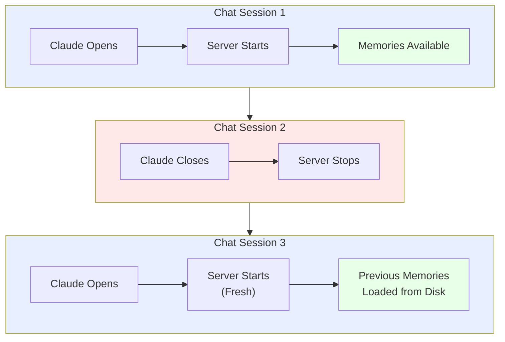

# Deployment Guide

Integrate devmcp-context with your agent for persistent memory across sessions.

## How It Works

When you configure devmcp-context in Claude Desktop:
1. Claude reads the MCP server configuration from your config file
2. When you start a chat, Claude **automatically starts** the devmcp-context server
3. The server stays running while you chat
4. When you close the chat or exit Claude, the server stops
5. Next time you chat, it starts fresh with any previously saved memories

**You don't manually run the server** - Claude handles startup and shutdown for you.



## For Claude Desktop Users

If you haven't set up devmcp-context with Claude yet, see [Getting Started](getting-started.md) for step-by-step instructions.

The rest of this guide covers advanced setups and production deployments.

## Manual Server Setup (Development/Testing)

For development or testing purposes, you can manually start the server:

```bash
cd /path/to/devmcp-context
uv run devmcp-context
```

The server will initialize and create an `ai-context/` directory in the current working directory. All memory is stored here in Markdown files.

To use a custom location:

```bash
cd /your/project/directory
uv run devmcp-context
```

Memory will be stored in `/your/project/directory/ai-context/`

## Agent Integration

### Claude Desktop (Recommended)

This is the main way most users will integrate devmcp-context. See [Getting Started](getting-started.md) for complete setup instructions.

The minimal config looks like:

```json
{
  "mcpServers": {
    "devmcp-context": {
      "command": "uv",
      "args": ["run", "--", "devmcp-context"],
      "cwd": "/absolute/path/to/your/project"
    }
  }
}
```

Once configured, Claude automatically handles:
- Starting the server when you open a chat
- Providing all 6 memory tools in the conversation
- Stopping the server when you exit Claude
- Creating the `ai-context/` directory on first use
- Persisting memories across sessions

No manual server management needed.

### Custom Agent

If building a custom agent, connect via MCP protocol:

1. Start the devmcp-context server
2. Connect to it via MCP client
3. Call the available tools
4. Handle responses

Example Python integration:

```python
from mcp_client import MCPClient

client = MCPClient()
client.connect("localhost", 3000)

# Save
client.call_tool("context_save", {
    "category": "project",
    "key": "api-version",
    "value": "v2.1.0"
})

# Load
entries = client.call_tool("context_load", {
    "category": "project"
})

# Search
results = client.call_tool("context_search", {
    "query": "database"
})
```

## Multi-Project Setup

### Using Agent Config (Recommended)

Register multiple devmcp-context servers in your agent config with different `cwd` values. Each gets its own memory folder:

```json
{
  "mcpServers": {
    "devmcp-context-project-a": {
      "command": "uv",
      "args": ["run", "--", "devmcp-context"],
      "cwd": "/path/to/project-a"
    },
    "devmcp-context-project-b": {
      "command": "uv",
      "args": ["run", "--", "devmcp-context"],
      "cwd": "/path/to/project-b"
    }
  }
}
```

Your agent can now manage memory for both projects independently. No env var switching needed.

### Manual Setup (Development Only)

For development, you can run separate server instances in different terminals:

```bash
# Project A (Terminal 1)
cd /path/to/project-a
uv run devmcp-context  # Stores in /path/to/project-a/ai-context/

# Project B (Terminal 2)
cd /path/to/project-b
uv run devmcp-context  # Stores in /path/to/project-b/ai-context/
```

But for production use with agents, the config approach above is cleaner.

## Production Deployment

### Systemd Service (Linux)

Create `/etc/systemd/system/devmcp-context.service`:

```ini
[Unit]
Description=devmcp-context Server
After=network.target

[Service]
Type=simple
WorkingDirectory=/path/to/devmcp-context
ExecStart=/usr/bin/uv run devmcp-context
Restart=on-failure
RestartSec=10
User=contextmcp

[Install]
WantedBy=multi-user.target
```

Start the service:

```bash
sudo systemctl enable devmcp-context
sudo systemctl start devmcp-context
sudo systemctl status devmcp-context
```

View logs:

```bash
sudo journalctl -u devmcp-context -f
```

### Docker

Create `Dockerfile`:

```dockerfile
FROM python:3.12-slim

WORKDIR /app
RUN pip install uv
COPY . .
RUN uv sync

EXPOSE 3000
CMD ["uv", "run", "devmcp-context"]
```

Build and run:

```bash
docker build -t devmcp-context .
docker run -d -v context-data:/app/ai-context -p 3000:3000 devmcp-context
```

### Environment Considerations

Memory persistence:
- Store `ai-context/` on persistent storage
- Back up regularly
- Consider version control for the memory files

Resource requirements:
- Minimal CPU usage
- Memory usage proportional to entry count
- No external database required

## Workflow Examples

### Single Agent, Persistent Memory

Agent runs once per day, continues work from previous day:

```
Day 1:
1. Agent starts
2. Loads project knowledge from "project" category
3. Loads current tasks from "tasks" category
4. Completes work and saves progress to "tasks"
5. Saves findings to "errors" or "project"
6. Agent stops

Day 2:
1. Agent starts (server still running)
2. Loads same project and task information
3. Continues where it left off
4. Updates task status
```

### Interactive Development

Developer debugging with agent assistance:

```
Session 1:
1. Save problem description to "ephemeral"
2. Agent analyzes and suggests solution
3. Save solution to "errors"

Session 2 (next day):
1. Similar problem emerges
2. Agent searches "errors" for similar issues
3. Finds previous solution
4. Applies known fix immediately
```

### Knowledge Building

Over time, build a knowledge base:

```
Week 1: Start project, save initial architecture to "project"
Week 2: Encounter bugs, save solutions to "errors"
Week 3: Make architecture decisions, save to "decisions"
Week 4: Reference all previous knowledge for new features
Month 2: New team member. Load all context and speed up onboarding
```

## Monitoring

### Check Memory Health

```bash
uv run devmcp-context-status
```

Shows:
- Total entries per category
- Active vs expired counts
- Oldest entry ages

### Manual Cleanup

Remove expired entries:

```bash
# After this command, expired entries are purged
uv run devmcp-context-purge
```

### Backup

Back up the ai-context folder:

```bash
cp -r ai-context ai-context.backup
```

For distributed backups:

```bash
tar -czf ai-context-backup-$(date +%Y%m%d).tar.gz ai-context/
```

## Troubleshooting

### Server won't start

Check Python version:
```bash
python --version  # Should be 3.12+
```

Check dependencies:
```bash
uv sync
```

### Memory not persisting

Verify ai-context folder permissions:
```bash
ls -la ai-context/
```

Should be readable/writable by the process.

### Search not finding entries

Search is case-insensitive and matches partial strings. Verify:
1. Entry is active (not expired)
2. Search term appears in key, value, or tags
3. Run context_status() to see what's available

### High memory usage

Run cleanup:
```bash
context_purge_expired()
```

Check memory file sizes:
```bash
du -h ai-context/
```
