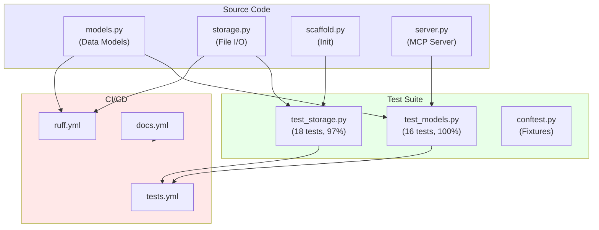
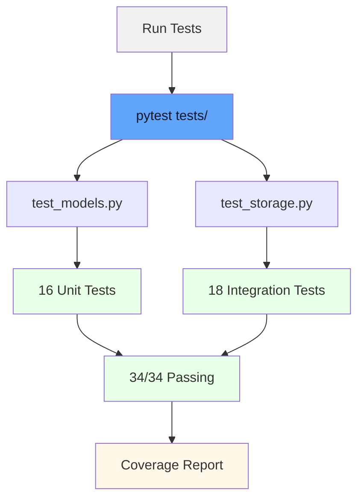
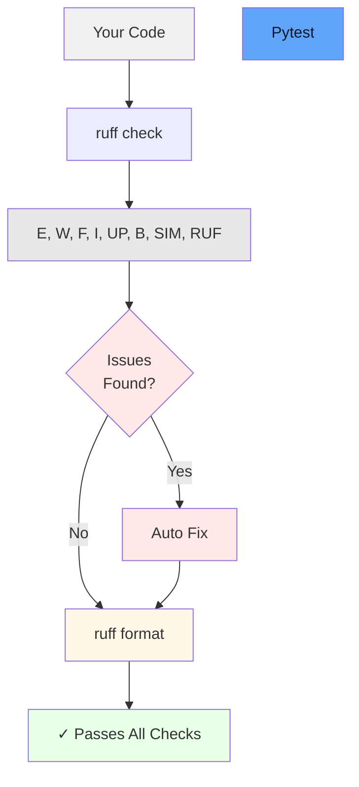

# Development Guide

Contribute to devmcp-context or extend it for your needs.

## Setup Development Environment

```bash
git clone https://github.com/kushal1o1/devmcp-context.git
cd devmcp-context
uv sync --all-extras
```

The `--all-extras` flag installs:
- pytest, pytest-cov for testing
- ruff for linting and formatting
- mkdocs for documentation

## Project Structure

```
devmcp-context/
  src/devmcp_context/
    __init__.py
    models.py           # Data models (Category, ContextEntry, CategoryFile)
    storage.py          # File I/O and persistence
    scaffold.py         # Project initialization
    server.py           # MCP server implementation
  tests/
    conftest.py         # Pytest fixtures
    test_models.py      # Model tests (16 tests)
    test_storage.py     # Storage tests (18 tests)
  docs/                 # Documentation source
  .github/workflows/    # CI/CD pipelines
  mkdocs.yml           # Docs configuration
  pyproject.toml       # Project metadata and dependencies
```



## Running Tests

Run all tests:

```bash
uv run pytest tests/ -v
```

Run specific test file:

```bash
uv run pytest tests/test_models.py -v
```

Run with coverage:

```bash
uv run pytest tests/ --cov=src/devmcp_context --cov-report=html
```

Test coverage includes:
- 100% coverage of models.py
- 97% coverage of storage.py
- 34 total tests, all passing



## Code Quality

Format code:

```bash
uv run ruff format src/ tests/
```

Check linting:

```bash
uv run ruff check src/ tests/
```

Auto-fix issues:

```bash
uv run ruff check --fix src/ tests/
```

Ruff rules enabled:
- E, W: pycodestyle errors and warnings
- F: pyflakes
- I: isort (import sorting)
- UP: pyupgrade
- B: flake8-bugbear
- SIM: flake8-simplify
- RUF: ruff-specific



## Adding Features

### Add a New Tool

1. Define the tool in `src/devmcp_context/server.py` using FastMCP decorator:

```python
@mcp.tool(
    description="Your tool description"
)
def my_tool(param: str) -> str:
    """Tool implementation."""
    return result
```

2. Add tests in `tests/test_storage.py` or `tests/test_models.py`

3. Update docs in `docs/api.md`

### Modify Data Model

1. Update `ContextEntry` or related models in `src/devmcp_context/models.py`

2. Update storage parsing in `src/devmcp_context/storage.py`

3. Add tests for the changes

4. Update markdown format in `to_md_block()` if needed

### Extend Storage

1. Add new functions to `src/devmcp_context/storage.py`

2. Handle backward compatibility

3. Add tests

4. Update API docs

## Documentation

Build docs locally:

```bash
uv run mkdocs serve
```

Visit http://localhost:8000 in your browser.

Docs are in `docs/` directory as Markdown files. Edit them directly:
- `docs/index.md` - Home page
- `docs/installation.md` - Installation
- `docs/quickstart.md` - Quick start
- `docs/usage.md` - Usage guide
- `docs/api.md` - API reference
- `docs/categories.md` - Memory categories
- `docs/deployment.md` - Deployment
- `docs/development.md` - This file

## CI/CD Pipelines

GitHub Actions automatically:
- Run tests on push to main/develop
- Run ruff lint checks
- Build and host docs
- Generate coverage reports

See `.github/workflows/` for configuration.

## Making a Pull Request

1. Create feature branch:

```bash
git checkout -b feature/your-feature
```

2. Make changes and test locally:

```bash
uv run pytest tests/ -v
uv run ruff check --fix src/ tests/
```

3. Commit with clear messages:

```bash
git commit -m "Add feature: description"
```

4. Push and create PR:

```bash
git push origin feature/your-feature
```

5. Wait for CI checks to pass

6. Request review

## Known Issues

Currently tracking in GitHub Issues.

Check the project repository for open issues and feature requests.

## Performance Considerations

Memory file sizes:
- Each entry is roughly 200-500 bytes in Markdown
- No indexing, search is linear through files
- For 1000+ entries per category, consider optimization

Optimization opportunities:
- Add indexing for search
- Implement caching
- Add database backend option
- Batch operations

## Dependencies

Core dependencies:
- `mcp[cli]>=1.0.0` - Model Context Protocol
- `pydantic>=2.0.0` - Data validation

Dev dependencies:
- `pytest>=7.0` - Testing
- `pytest-cov>=4.0` - Coverage
- `ruff>=0.1.0` - Linting and formatting

## Versioning

Uses semantic versioning (MAJOR.MINOR.PATCH).

Current version: 0.1.0 (alpha)

Bump version in `pyproject.toml` for releases.

## License

MIT License. See LICENSE file.

Contributions are licensed under the same MIT License.

## Questions?

Open an issue on GitHub or check existing discussions.
