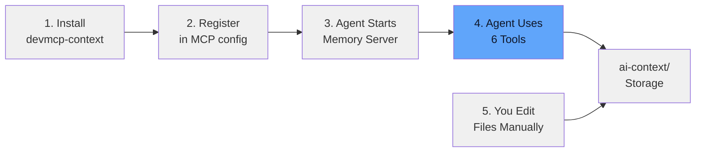
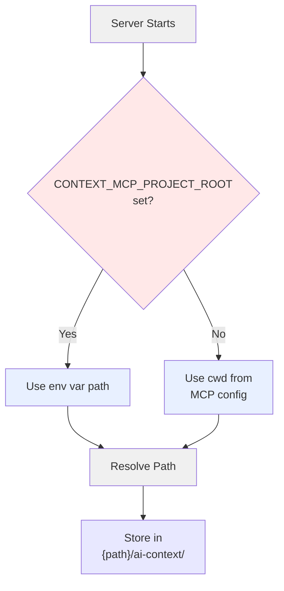

# Getting Started

## The Problem

AI agents work in a black box. You don't see what they remember. You can't edit their memories when they're wrong. You can't fix a mistaken belief without restarting from scratch.

**devmcp-context solves this.** Your agent's memory is now visible, editable, and persistent — stored as plain Markdown files in your project folder.

## How It Works

1. **You install devmcp-context** in your project
2. **You register devmcp-context in your agent's MCP config** (one-time setup)
3. **Your agent automatically wakes up the memory server** when you start a session
4. **The agent can now see, save, update, and search its memories** across conversations
5. **You can manually inspect and edit memories** in `ai-context/` folder anytime



## Step 1: Install devmcp-context

```bash
# Clone the repository
git clone https://github.com/kushal1o1/devmcp-context.git
cd devmcp-context

# Install dependencies
uv sync
```

This creates a virtual environment and installs everything needed.

## Step 2: Understand Path Resolution

When devmcp-context starts, it determines where to store memory using this priority:

1. **Environment variable** — If `CONTEXT_MCP_PROJECT_ROOT` is set, use that path
2. **Working directory** — Otherwise, use the current working directory (`cwd`)

The `cwd` is set by your MCP configuration. Memory files are always stored in `{resolved_path}/ai-context/`.



### When to Use `CONTEXT_MCP_PROJECT_ROOT`

**Use it when:**
- Running devmcp-context manually for testing/development and need to override the working directory
- Custom agents that need to point to a different memory location at runtime
- Container deployments where the working directory doesn't match your project path

**Don't use it for multiple projects** — Instead, register multiple servers with different `cwd` values (see [Using Multiple Projects](#using-multiple-projects) section).

### Example Path Resolution

If you configure:
```json
"cwd": "/home/user/my-project"
```

Then memory lives in:
```
/home/user/my-project/ai-context/
```

To override at runtime (rare):
```bash
export CONTEXT_MCP_PROJECT_ROOT="/custom/path"
# Then start your agent
```

Memory will go to `/custom/path/ai-context/` instead.

## Step 3: Register with Your Agent

### Claude Desktop

Add to your Claude config file:

**Config file location:**
- **macOS/Linux:** `~/.config/Claude/claude_desktop_config.json`
- **Windows:** `%APPDATA%\Claude\claude_desktop_config.json`

**Config content:**
```json
{
  "mcpServers": {
    "devmcp-context": {
      "command": "uv",
      "args": ["run", "--", "devmcp-context"],
      "cwd": "/absolute/path/to/your/project"
    }
  }
}
```

Replace `/absolute/path/to/your/project` with your actual project path (must be absolute).

**Examples:**
```json
{
  "mcpServers": {
    "devmcp-context": {
      "command": "uv",
      "args": ["run", "--", "devmcp-context"],
      "cwd": "/Users/alice/projects/my-app"
    }
  }
}
```

### Other MCP Agents

Any agent supporting MCP can use devmcp-context. Register it similarly:

**For Node.js/JavaScript agents:**
```json
{
  "mcpServers": {
    "devmcp-context": {
      "command": "uv",
      "args": ["run", "--", "devmcp-context"],
      "cwd": "/path/to/your/project"
    }
  }
}
```

**For Python agents (direct):**
```python
import subprocess
from pathlib import Path

# Start devmcp-context
server = subprocess.Popen(
    ["uv", "run", "devmcp-context"],
    cwd="/path/to/your/project"
)

# Now connect to the MCP server and use its tools
```

**For Docker/Container deployment:**
```bash
docker run -d \
  -v /path/to/project:/project \
  -e CONTEXT_MCP_PROJECT_ROOT=/project \
  my-mcp-agent
```

## Step 4: Restart Your Agent

Close and reopen your agent application. The devmcp-context server is now available.

## Step 5: Test the Setup

Start a new session and ask your agent to check memory:

**Prompt:** "Use context_status to show me the memory tools"

Your agent should respond with:
- Available categories (project, decisions, errors, tasks, ephemeral)
- Entry counts per category
- Tip about using context_load to retrieve entries

## Where Are My Memories?

After saving memories, they appear as Markdown files:

```
your-project/
├── ai-context/
│   ├── project.md        (permanent knowledge)
│   ├── decisions.md      (architecture/design choices)
│   ├── errors.md         (bugs fixed, expires in 30 days)
│   ├── tasks.md          (current tasks, expires in 14 days)
│   ├── ephemeral.md      (temporary notes, expires in 1 day)
│   └── _meta.md          (category descriptions)
├── src/
├── tests/
└── ... your project files
```

You can **open and edit these files directly** in any text editor. The format is plain Markdown.

## Example: Using Memory with Your Agent

**Save memory:**
> "Save to project memory: Database is PostgreSQL 15 with connection pooling."

Agent calls `context_save` behind the scenes.

**Retrieve memory:**
> "What database are we using?"

Agent calls `context_search` and finds your saved note.

**Manually fix memory:**
Open `ai-context/project.md` and edit the entry directly. Agent sees the change on next read.

## Understanding Memory Categories

| Category | Auto-Expires | Purpose |
|----------|-------------|---------|
| `project` | Never | Architecture, stack, critical facts |
| `decisions` | Never | Why you chose something, trade-offs |
| `errors` | 30 days | Bugs fixed, what went wrong, solutions |
| `tasks` | 14 days | Current work, in-progress items |
| `ephemeral` | 1 day | Temporary notes, scratchpad, tests |

Expired entries are kept until you run `context_purge_expired`.

## Using Multiple Projects

Each project gets independent memory. Register multiple servers in your agent config:

```json
{
  "mcpServers": {
    "devmcp-context-project-a": {
      "command": "uv",
      "args": ["run", "--", "devmcp-context"],
      "cwd": "/path/to/project-a"
    },
    "devmcp-context-project-b": {
      "command": "uv",
      "args": ["run", "--", "devmcp-context"],
      "cwd": "/path/to/project-b"
    }
  }
}
```

Each server starts with its own `cwd` and maintains separate `ai-context/` folders automatically. **No env var switching needed** — just ask your agent to use `devmcp_context_project_a` or `devmcp_context_project_b` memory tools as needed.

## Troubleshooting

### "MCP server not found"

- Verify config file path is correct for your OS
- Check that `cwd` is an absolute path (not relative like `./project`)
- Restart your agent completely
- Check agent logs for detailed error messages

### "Command 'uv' not found"

- Make sure `uv` is installed: `curl -LsSf https://astral.sh/uv/install.sh | sh`
- Restart your terminal after installing `uv`
- Use full path to `uv` if needed: `/usr/local/bin/uv` or `C:\path\to\uv.exe`

### Memory files not created

- Check that `cwd` exists and is readable
- Verify the path is absolute, not relative
- `ai-context/` folder is created automatically on first memory save

### Path confusion

- The `cwd` in MCP config is where the server starts
- Memory lives in `{cwd}/ai-context/`
- Use absolute paths only — no `~`, no relative paths like `./project`
- To override, set `CONTEXT_MCP_PROJECT_ROOT` environment variable

## Next Steps

- Read [Memory Categories](categories.md) to understand TTLs and expiration
- Check [API Reference](api.md) for all available tools
- See [Deployment Guide](deployment.md) for production setups and advanced configurations
