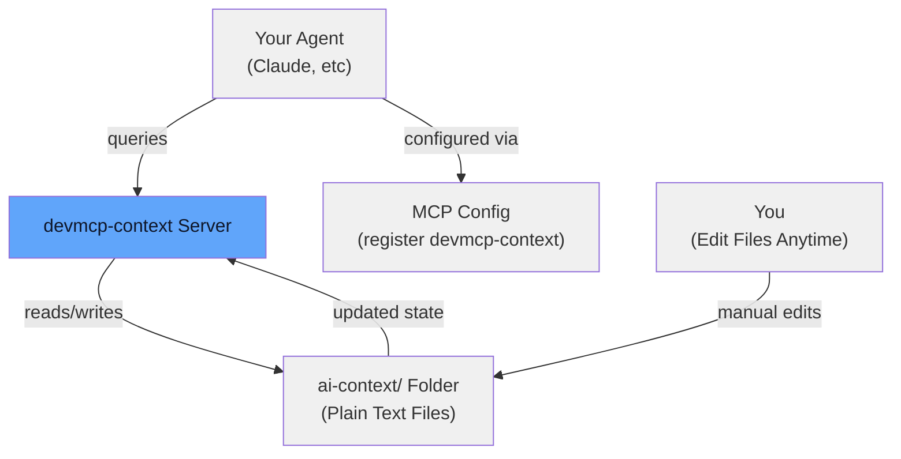

# devmcp-context

	

See what your AI agent actually knows. Edit it. Remove it. Fix it. All without retraining.

## The Problem

AI agents are black boxes. You can't see what they remember. When they forget something important or remember something wrong, you're stuck. You have no way to inspect their memory, fix mistakes, or pick what matters.

**devmcp-context changes this.** Your agent's memory is now:
- **Visible** - Plain text files in your project folder
- **Editable** - Open any file, make changes, agent sees them immediately
- **Structured** - Organized into 5 categories with automatic cleanup
- **Persistent** - Survives across agent sessions and restarts

## How It Works

1. **You install devmcp-context** in your project
2. **You register devmcp-context in your agent's MCP config** (one-time setup)
3. **Your agent automatically wakes up the memory server** when you start a session
4. **The agent can now see, save, update, and search its memories** across conversations
5. **You can manually inspect and edit memories** in `ai-context/` folder anytime

## Why This Matters

**Before devmcp-context:**
- Agent forgets what it learned last session
- You can't see what it thinks it knows
- No way to fix a mistake without starting over

**With devmcp-context:**
- Persistent memory across conversations
- Visual inspection of all memories
- Manual editing capability
- No database, no complexity - just plain text

## Memory Categories

- **project** - Architecture, stack, permanent knowledge (never expires)
- **decisions** - Why you chose something, trade-offs (never expires)
- **errors** - Bugs fixed, what went wrong, solutions (expires in 30 days)
- **tasks** - Current work, in-progress items (expires in 14 days)
- **ephemeral** - Temporary notes, scratchpad (expires in 1 day)

## Quick Links

- [Getting Started](getting-started.md) - Setup guide with step-by-step instructions for any MCP agent
- [Installation](installation.md) - Install devmcp-context
- [API Reference](api.md) - All available tools
- [Memory Categories](categories.md) - Deep dive into each category
- [Deployment Guide](deployment.md) - Production setups, Docker, systemd
- [Development](development.md) - Contribute or extend

## License

MIT License - See [LICENSE](https://github.com/kushal1o1/devmcp-context/blob/main/LICENSE) for details.
