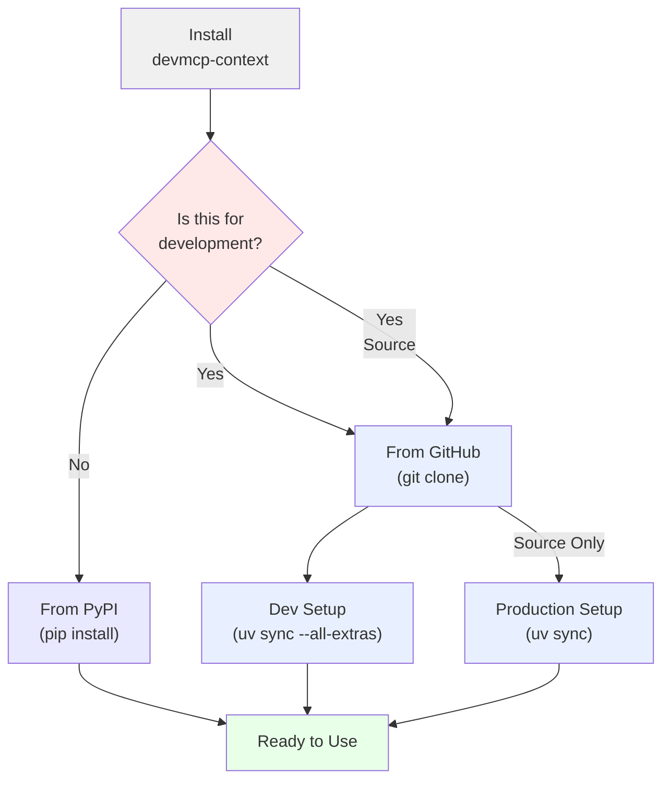

# Installation

## Prerequisites

- Python 3.12 or higher
- `uv` package manager (recommended) or `pip`

## Install uv

If you don't have `uv` installed, install it first:

```bash
curl -LsSf https://astral.sh/uv/install.sh | sh
```

After installation, restart your terminal so `uv` is in your PATH.

Verify installation:
```bash
uv --version
```

## Install devmcp-context

### Option 1: From GitHub (Recommended)

```bash
git clone https://github.com/kushal1o1/devmcp-context.git
cd devmcp-context
uv sync
```

This installs the project and all dependencies in an isolated virtual environment.

### Option 2: From PyPI

Once published to PyPI:

```bash
pip install devmcp-context
```

### Option 3: Development Installation

If you want to modify or contribute to devmcp-context:

```bash
git clone https://github.com/kushal1o1/devmcp-context.git
cd devmcp-context
uv sync --all-extras
```

The `--all-extras` flag installs development dependencies including testing and linting tools.



## Verify Installation

Test that everything works:

```bash
uv run devmcp-context --help
```

You should see the server name and available MCP tools listed.

## Next Steps

- [Quick Start](quickstart.md) — Start using devmcp-context in minutes
- [Usage Guide](usage.md) — Learn the complete workflow
- [Deployment](deployment.md) — Integrate with your agent
