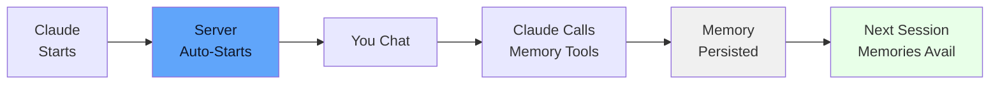

# Quick Start

## Using with Claude (Recommended)

If you've set up devmcp-context with Claude Desktop, you're ready to go. Just start chatting:

> "I have a new project. Let me save the tech stack to memory: We're using Python 3.12, FastAPI, and PostgreSQL."

Claude automatically calls the memory tools. You don't need to manually invoke them.

To review what was saved:

> "Show me what's in project memory."

Claude retrieves and displays your memories.



## Exploring the API (Development/Testing)

If you want to manually test the API or use devmcp-context in development, start the server:

```bash
cd /path/to/devmcp-context
uv run devmcp-context
```

Then use the tools directly:

### 1. Save Information

Use the `context_save` tool to store information:

```python
save_entry(
    category="project",
    key="auth-strategy",
    value="Using OAuth2 with JWT tokens for API authentication",
    tags=["auth", "security"],
    ttl_days=None  # Never expires
)
```

### 2. Load Information

Retrieve entries from a category:

```python
load_category(
    category="project",
    include_expired=False
)
```

Returns all active entries in the project category.

### 3. Search Information

Search across all categories:

```python
search_all(query="auth")
```

This searches in:
- Entry keys
- Entry values
- Entry tags

Case-insensitive matching.

### 4. View Status

Get a summary of all categories:

```python
context_status()
```

Shows:
- Total entries per category
- Active vs expired counts
- Memory footprint

### 5. Clean Up

Remove expired entries:

```python
purge_expired()
```

Deletes entries that have passed their TTL.

## Example Use Cases

### Tracking a Bug Fix

```
category: "errors"
key: "bug-login-redirect"
value: "Users redirected to wrong page after login. Fixed by updating AuthService callback URL."
tags: ["authentication", "critical", "resolved"]
```

### Storing Architecture Decision

```
category: "decisions"
key: "database-choice"
value: "Chose PostgreSQL over MongoDB because: 1) Strong ACID guarantees, 2) Complex query support, 3) Team expertise"
tags: ["infrastructure", "database"]
ttl_days: None  # Permanent
```

### Task Tracking

```
category: "tasks"
key: "api-refactor-in-progress"
value: "Refactoring user API endpoints for consistency. Currently on authentication endpoints."
tags: ["backend", "refactor", "urgent"]
ttl_days: 14  # Expires in 2 weeks
```

### Temporary Notes

```
category: "ephemeral"
key: "current-conversation-context"
value: "User is debugging the data pipeline. Last error was in the ETL transform step."
tags: ["context"]
# Auto-expires in 1 day
```

## Memory Categories

Each category has a default TTL (time-to-live):

| Category | Default TTL | Purpose |
|----------|-------------|---------|
| project | Never | Long-term project knowledge |
| decisions | Never | Architecture and design decisions |
| errors | 30 days | Bug reports and fixes |
| tasks | 14 days | Current tasks and blockers |
| ephemeral | 1 day | Temporary conversation context |

## Next Steps

- [Usage Guide](usage.md) - Detailed examples and patterns
- [API Reference](api.md) - Complete tool documentation
- [Deployment](deployment.md) - How to use with your agent
