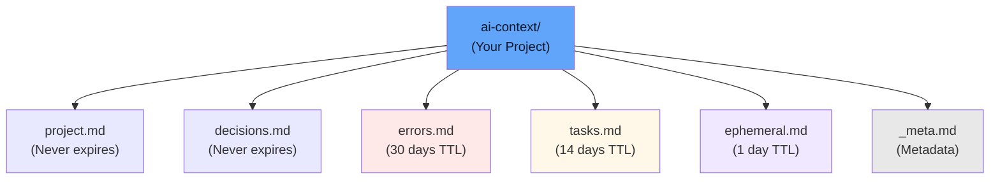

# Usage Guide

## Memory Structure

All memory is stored in the `ai-context/` folder relative to where the server runs:

```
your-project/
  ai-context/
    project.md
    decisions.md
    errors.md
    tasks.md
    ephemeral.md
    _meta.md
```

Each `.md` file contains entries for that category in a human-readable format.



## Saving Entries

### Basic Save

```python
context_save(
    category="project",
    key="database-url",
    value="postgresql://localhost:5432/myapp"
)
```

### With Tags

```python
context_save(
    category="errors",
    key="timeout-issue",
    value="API calls timeout after 30 seconds. Solution: increase timeout threshold.",
    tags=["api", "timeout", "critical"]
)
```

### Custom TTL

```python
context_save(
    category="tasks",
    key="refactor-done",
    value="Payment service refactoring completed",
    ttl_days=7  # Override default 14 days
)
```

### From Different Sources

```python
context_save(
    category="project",
    key="test-coverage",
    value="Unit tests cover 85% of the codebase",
    source="qa"  # Instead of default "agent"
)
```

## Loading Entries

### Load All Active Entries

```python
entries = context_load(category="project")
```

Returns a list of active (non-expired) entries.

### Include Expired Entries

```python
all_entries = context_load(
    category="errors",
    include_expired=True
)
```

Useful for historical analysis before purging.

## Searching

### Simple Search

```python
results = context_search(query="database")
```

Matches against:
- Entry keys
- Entry values
- Entry tags

### Search Examples

```python
# Search by topic
context_search("authentication")

# Search by error type
context_search("timeout")

# Search by technology
context_search("postgresql")
```

Results are returned with the entry details and which category they're in.

## Deleting Entries

### Delete Single Entry

```python
context_delete(
    category="tasks",
    key="old-task"
)
```

Returns `True` if deleted, `False` if not found.

## Maintenance

### Get Status

```python
status = context_status()
```

Returns summary for each category:
- Total entries
- Active entries
- Expired entries
- Age of oldest entry

### Purge Expired

```python
removed_count = context_purge_expired()
```

Removes all expired entries across all categories. Returns the count of removed entries.

## Best Practices

### Use Consistent Keys

Avoid key names like "fix-1", "temp-2". Use descriptive keys:

```
Good:  "payment-service-timeout"
Bad:   "issue-1"
```

### Leverage Tags

Use tags for filtering and organization:

```python
context_save(
    category="errors",
    key="db-connection-pool",
    value="Connection pool exhausted under load",
    tags=["database", "performance", "critical", "production"]
)
```

### Set Appropriate TTL

- `ttl_days=None` for permanent knowledge (project structure, architecture)
- `ttl_days=90` for reference materials (resolved bugs, past decisions)
- `ttl_days=14` for current work (active tasks, blockers)
- `ttl_days=1` for temporary context (current conversation notes)

### Regular Cleanup

Schedule `purge_expired()` periodically to keep memory lean. Consider running it:
- Daily at off-peak times
- When context memory reaches a threshold
- Before critical operations

### Archive Important Entries

Before they expire, if they're still relevant:

```python
# Re-save with updated timestamp and extended TTL
context_save(
    category="errors",
    key="critical-bug-fix-2024",
    value="...",
    ttl_days=365  # Extend validity
)
```

## Integration Patterns

### Single Agent Session

Start fresh for each session:

```python
context_status()  # See what's available
context_load("project")  # Load project context
# ... do work ...
context_save(...)  # Save new findings
```

### Multi-Session Continuity

Leverage persistent memory:

```python
# Session 1
context_save("errors", "timeout-bug", "Found cause: missing timeout config")

# Session 2 (days later)
results = context_search("timeout")  # Still available!
```

### Conversational Context

Use ephemeral category:

```python
context_save(
    category="ephemeral",
    key="conversation-state",
    value="User is analyzing Q3 sales data"
)
```

Auto-expires in 1 day, good for temporary session notes.

## Next Steps

- [API Reference](api.md) — Complete tool documentation
- [Memory Categories](categories.md) — Deep dive into each category
- [Deployment](deployment.md) — Integration with agents
