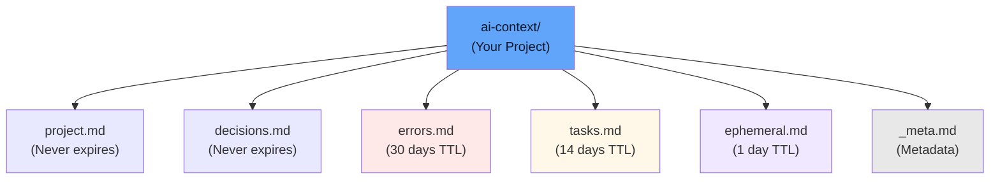

# Usage Guide

## Memory Structure

All memory is stored in the `ai-context/` folder relative to where the server runs:

```
your-project/
  ai-context/
    project.md
    decisions.md
    errors.md
    tasks.md
    ephemeral.md
    _meta.md
    _session_log.md   ← session recall metrics
```

Each `.md` file contains entries for that category in a human-readable format.



## Saving Entries

### Basic Save

```python
context_save(
    category="project",
    key="database-url",
    value="postgresql://localhost:5432/myapp"
)
```

### Key Fact First

Put the most important information on the first line. It's what shows in session summaries:

```python
context_save(
    category="errors",
    key="timeout-issue",
    value="API calls timeout after 30s - fix: increase nginx timeout\nRoot cause: missing timeout config in load balancer\nFile: /etc/nginx/upstream.conf, line 42",
    tags=["api", "timeout", "critical"]
)
```

### With Outcome Fields

For `decisions` and `errors`, track what worked and what failed:

```python
context_save(
    category="decisions",
    key="db-choice",
    value="Chose PostgreSQL over MongoDB for the billing service",
    tags=["database", "architecture"],
    what_worked="ACID guarantees, strong JOIN support",
    what_failed="Heavier than MongoDB for document workloads"
)
```

### Superseding Entries

Instead of deleting outdated entries, point to the successor:

```python
# Save the new entry
context_save(
    category="decisions",
    key="new-auth",
    value="Switched to OAuth2 with GitHub provider",
    tags=["auth"]
)

# Mark the old one as superseded
context_save(
    category="decisions",
    key="old-auth",
    value="Cookie-based sessions (replaced by OAuth2)",
    superseded_by="new-auth"
)
```

Search and recall skip superseded entries and return the successor instead.

### Custom TTL

```python
context_save(
    category="tasks",
    key="refactor-done",
    value="Payment service refactoring completed",
    ttl_days=7  # Override default 14 days
)
```

## Loading Entries

### Load All Active Entries

```python
entries = context_load(category="project")
```

Returns a list of active (non-expired) entries.

### Include Expired Entries

```python
all_entries = context_load(
    category="errors",
    include_expired=True
)
```

Useful for historical analysis before purging.

## Searching

### Simple Search

```python
results = context_search(query="database")
```

Matches against:
- Entry keys
- Entry values
- Entry tags

### Search Examples

```python
# Search by topic
context_search("authentication")

# Search by error type
context_search("timeout")

# Search by technology
context_search("postgresql")
```

Results are returned with the entry details and which category they're in.

## Deleting Entries

### Delete Single Entry

```python
context_delete(
    category="tasks",
    key="old-task"
)
```

Returns `True` if deleted, `False` if not found.

## Maintenance

### Get Status

```python
status = context_status()
```

Returns summary for each category:
- Total entries
- Active entries
- Expired entries
- Age of oldest entry

### Purge Expired

```python
removed_count = context_purge_expired()
```

Removes all expired entries across all categories. Returns the count of removed entries.

## Best Practices

### Use Consistent Keys

Avoid key names like "fix-1", "temp-2". Use descriptive keys:

```
Good:  "payment-service-timeout"
Bad:   "issue-1"
```

### Leverage Tags

Use tags for filtering and organization:

```python
context_save(
    category="errors",
    key="db-connection-pool",
    value="Connection pool exhausted under load",
    tags=["database", "performance", "critical", "production"]
)
```

### Set Appropriate TTL

- `ttl_days=None` for permanent knowledge (project structure, architecture)
- `ttl_days=90` for reference materials (resolved bugs, past decisions)
- `ttl_days=14` for current work (active tasks, blockers)
- `ttl_days=1` for temporary context (current conversation notes)

### Regular Cleanup

Schedule `purge_expired()` periodically to keep memory lean. Consider running it:
- Daily at off-peak times
- When context memory reaches a threshold
- Before critical operations

### Archive Important Entries

Before they expire, if they're still relevant:

```python
# Re-save with updated timestamp and extended TTL
context_save(
    category="errors",
    key="critical-bug-fix-2024",
    value="...",
    ttl_days=365  # Extend validity
)
```

## Integration Patterns

### Single Agent Session

Start each session with auto-recall:

```python
session = context_session_start()  # Auto-loads memory
# Read auto-loaded project knowledge
# Read compact index of other categories
# ... do work ...
context_save(...)  # Save new findings
context_log_session_recall()  # Log whether recall was used
```

### Multi-Session Continuity

Leverage persistent memory and superseded entries:

```python
# Session 1
context_save("decisions", "auth-v1", "Cookie-based sessions")

# Session 2 (days later)
context_save("decisions", "auth-v2", "Switched to JWT", superseded_by="auth-v1")

# Session 3 - search skips auth-v1, returns auth-v2
results = context_search("auth")  # Returns auth-v2
```

### Outcome Tracking

Track what worked and what failed for future reference:

```python
context_save(
    category="errors",
    key="db-pool-fix",
    value="Connection pool exhausted under load - increased pool size to 50",
    what_worked="Increased pool size, added connection timeout",
    what_failed="First tried recycling connections (caused deadlocks)"
)
```

## Next Steps

- [API Reference](api.md) - Complete tool documentation
- [Memory Categories](categories.md) - Deep dive into each category
- [Deployment](deployment.md) - Integration with agents
